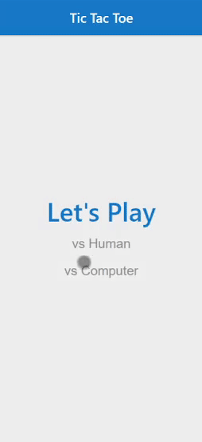

# Tic Tac Toe

<a href="https://kfig21.github.io/tic_tac_toe_react/" target="_blank" rel="noopener noreferrer">View the project here!</a> 👀

<h3>Summary</h3>

This project was built for The Odin Project JavaScript curriculum. A Tic-Tac-Toe game built with React, play against a friend or vs the computer. Players are able to change their name and markers. This project was made with the React JS Library and CSS.

<h3>Features: </h3>

- Play vs another player or a CPU
- Players can change their name and marker
- Responsive Design

<h3>Demo GIF</h3>

<h4>Desktop</h4>

<h4>Mobile</h4>

-----------------------------

<h3>Thanks for checking out my project! Any && all feedback is appreciated!</h3>
